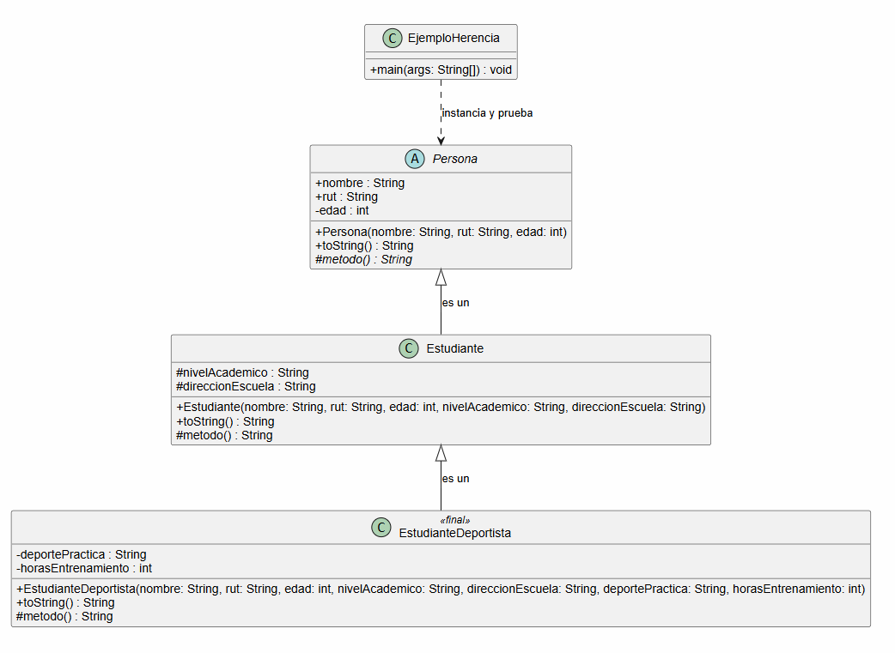
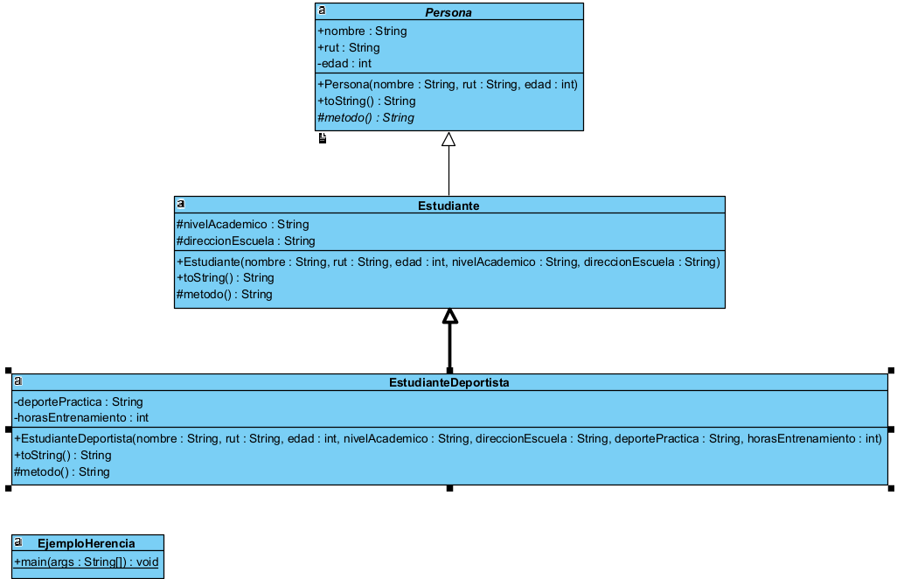
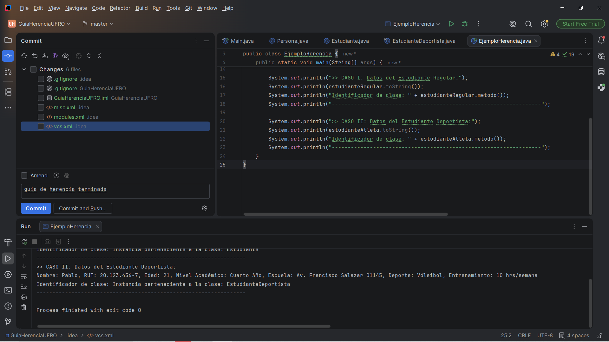

# Guía de Trabajo: Implicancias de la Herencia (UFRO) Bastián Escobar

Este repositorio contiene la resolución del caso de estudio sobre herencia, aplicando conceptos de clases abstractas, clases finales y herencia en cascada en Java.

## 📊 1. Diagrama de Clases UML
Aquí se detalla minuciosamente el modelado de las entidades solicitadas:

## Diagrama de Clases UML (Visual Paradigm)
Diseño minucioso generado mediante ingeniería inversa, donde se aprecia la clase abstracta *Persona* (en cursiva) y la jerarquía de herencia:

## 🚀 2. Prueba de Ejecución Exitosa
Captura de pantalla de la consola de IntelliJ IDEA demostrando que el programa compila, se ejecuta sin errores y aplica correctamente el polimorfismo dinámico:

## 🛠️ Tecnologías e IDEs Utilizados
* **Lenguaje:** Java 
* **IDE de Desarrollo:** IntelliJ IDEA
* **Modelado:** PlantUML / Estándar UML
